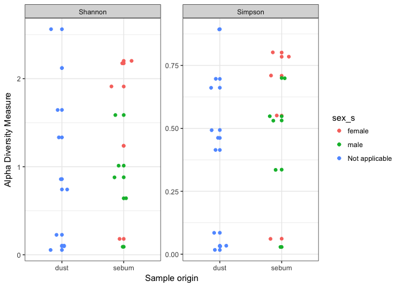

Analysis Report 1: Behind-the-scenes biological implications: A Distribution and representation analyis on a DADA2/Phyloseq Pipeline using a Fierer et. al (2010) dataset
================
Alfredo H. Locht
01Nov2017

Introduction
============

Complete quantification and representation of the bacterial diversity inherently present in the entire human microbiota represents a daunting task transcending multiple scales of magnitude: Bacterial diversity is directly influenced by factors such as the diet, lifestyle, and environmental conditions of the human host and indirectly influenced by factors such as the relationship dynamic between the communities present, the morphology and structure of the area where they reside, and the disease profile of the host (Grice and Segre, 2011; Ying *et al.*, 2015) Furthermore, bacterial diversity also relies on the structure and composition of the commnuity itself, which differs greatly between individual sites on the same host (Ying *et al.*, 2015). The study of the human microbiota has therefore, become a focus of increasing interest for many researchers because of its implications in modulation of the host metabolism, training of the innate immune system, and regulation of host behavior (Rajilic-Stojanovi and Vos, 2014).

In particular, the skin microbiome is very interesting for researchers mainly because there are disagreements as to whether the diversity of this habitat has some constant residents and structure, or whether it is completely dynamic and able to be replaced. Among the factors that are known to influence the skin microbiota include age, gender, place of residence, and even communal living with animals (Troccaz *et al.*, 2009; Ying *et al.*, 2015). Fierer et. al, has actually shown in two separate studies, that the the bacterial communities present on human palm skin have actually adapted to this hazardous environment and are uniquely permanent residents that can withstand multiple environmental stressors and are temporally durable (Fierer *et al.*, 2008, 2010).

Among the reasons why the skin has become an important contributer to the identity and classification of human microbiota, is that:

1.  It is the largest organ in the human body.
2.  It is easily accessible and available for sampling.
3.  Regions of skin can vary substantially based on humidity, temperature, cellular structure, and exposure to elements which directly influence how bacteria.

In this particular study, analysis will be focused on a dataset created in the Fierer et. al. paper, Forensic identification using skin bacterial communities, where identification of individuals was accomplished by swabbing both their hands and their computer mice for bacterial communities and comparing the skin communities to the computer mice communities. This report will instead focus on the multiple Phyla found in each sample and attempt to affirm the following hypothesis:

1.  There are prevalent phyla of bacteria specifically found on humans that are not found on the computer mice.
2.  These bacteria have health and biological implications that can be correlated.
3.  Possible lifestyle choices and personal hygeine can be inferred from the human samples where certain bacteria known to be pathogenic reside.

Methods
=======

Sample origin and sequencing
----------------------------

In this report, we analyze a raw dataset produced by Fierer et. al for their journal article "Forensic identification using skin bacterial communities" (Fierer *et al.*, 2010). In this study, Fierer et. al creates the dataset by sampling the palms of nine individuals (four female and five male participants) with autoclaved, cotton-tipped swabs that were dipped in a sterile solution beforehand as well as his or her corresponding computer mouse that had been left untouched for twelve hours. Each swab

The DNA from each of the bacterial communities present was extracted in each sample were sequenced using pyrosequencing methods.

Computational
-------------

Steps in DADA2 Pipeline: -Check Quality plots for raw data using the fastq quality scores. -Filtered Raw sequences for max length of 225 bp, no N's allowed, up to 3 expected errors, and to truncate any sequences where the confidence score dropped below a 2. -Obtained the reads that passed the sequence filter (different from FASTQC) -Built a statistical model identifying if our trim was accurate or not. All the plots -Eliminate replicated sequences. -Identified unique sequences from all the reads in each sample using DADA2 -Created Sequence table and made a histogram to show that the majority of our sequences were 225 bp long. -Removed chimeras and built a table showing how many sequences we were left with at each step of the QC process. Table looks ok except for ERR199485 and ERR199482 which considerably lose most of the sequences composing that sample after the first sequence filter.

Results
=======

``` r
# Be sure to install these packages before running this script
# They can be installed either with the intall.packages() function
# or with the 'Packages' pane in RStudio

# load general-use packages
library("dplyr")
library("tidyr")
library("knitr")
library("ggplot2")

# this package allows for the easy inclusion of literature citations in our Rmd
# more info here: https://github.com/crsh/citr
# and here:
# http://rmarkdown.rstudio.com/authoring_bibliographies_and_citations.html
library("citr")

# These are the primary packages well use to clean and analyze the data
# this package needs to be installed from bioconductor -- it's not on CRAN
# see info here: https://benjjneb.github.io/dada2/dada-installation.html
library("dada2")

# This to export a fasta of our final denoised sequence variants
library("seqinr")

# To install this you have to install from GitHub
# See more info here: https://github.com/leffj/mctoolsr
# run this -- install.packages("devtools")
# and then this -- devtools::install_github("leffj/mctoolsr")
library("mctoolsr")

# And this to visualize our results
# it also needs to be installed from bioconductor
library("phyloseq")
```

``` r
# NOTE: Much of the following follows the DADA2 tutorials available here:
# https://benjjneb.github.io/dada2/tutorial.html
# Accessed October 19, 2017

# set the base path for our input data files
path <- "data/raw_data"

# Sort ensures samples are in order
filenames_forward_reads <- sort(list.files(path, pattern = ".fastq"))

# Extract sample names, assuming filenames have format: SAMPLENAME.fastq
sample_names <- sapply(strsplit(filenames_forward_reads, "\\."), `[`, 1)

# Specify the full path to each of the filenames_forward_reads
filenames_forward_reads <- file.path(path, filenames_forward_reads)
```

``` r
# Plots the quality profiles of all twenty samples
plotQualityProfile(filenames_forward_reads[1:20])
```


We can see from the quality profiles that most reads tend to get pretty bad in quality after around 200 bases. Therefore, we decided to set a maximum acceptable sequence length of 225 bases.

``` r
# Place filtered files in filtered/ subdirectory
# note this will fail if the directory doesn't exist
filter_path <- file.path("output", "filtered")
filtered_reads_path <- file.path(filter_path,
                                 paste0(sample_names,
                                        "_filt.fastq.gz"))

# See ?filterAndTrim for details on the parameters
# See here for adjustments for 454 data:
# https://benjjneb.github.io/dada2/
# faq.html#can-i-use-dada2-with-my-454-or-ion-torrent-data
filtered_output <- filterAndTrim(fwd = filenames_forward_reads,
                                 filt = filtered_reads_path,
                                 maxLen = 225,
                                maxN = 0, # discard any seqs with Ns
                                 maxEE = 3, # allow w/ up to 3 expected errors
                                 truncQ = 2, # cut off if quality gets this low
                                 rm.phix = TRUE,
                                 compress = TRUE,
                                 multithread = FALSE)
```

``` r
# produce nicely-formatted markdown table of read counts
# before/after trimming
kable(filtered_output,
      col.names = c("Reads In",
                    "Reads Out"))
```

|                  |  Reads In|  Reads Out|
|------------------|---------:|----------:|
| ERR1942280.fastq |       404|        350|
| ERR1942281.fastq |       422|        194|
| ERR1942282.fastq |       412|         31|
| ERR1942283.fastq |       791|        426|
| ERR1942284.fastq |       677|        525|
| ERR1942285.fastq |       443|         72|
| ERR1942286.fastq |       667|        617|
| ERR1942287.fastq |       590|        541|
| ERR1942288.fastq |       908|        877|
| ERR1942289.fastq |       372|        147|
| ERR1942290.fastq |       468|        249|
| ERR1942291.fastq |       933|        819|
| ERR1942292.fastq |       724|        709|
| ERR1942293.fastq |       811|        470|
| ERR1942294.fastq |       938|        552|
| ERR1942295.fastq |       705|        620|
| ERR1942296.fastq |       754|        441|
| ERR1942297.fastq |       275|        246|
| ERR1942298.fastq |       562|        389|
| ERR1942299.fastq |      1025|        852|

``` r
# this build error models from each of the samples
errors_forward_reads <- learnErrors(filtered_reads_path,
                                    multithread = FALSE)
```

    ## Not all sequences were the same length.
    ## Not all sequences were the same length.
    ## Not all sequences were the same length.
    ## Not all sequences were the same length.
    ## Not all sequences were the same length.
    ## Not all sequences were the same length.
    ## Not all sequences were the same length.
    ## Not all sequences were the same length.
    ## Not all sequences were the same length.
    ## Not all sequences were the same length.
    ## Not all sequences were the same length.
    ## Not all sequences were the same length.
    ## Not all sequences were the same length.
    ## Not all sequences were the same length.
    ## Not all sequences were the same length.
    ## Not all sequences were the same length.
    ## Not all sequences were the same length.
    ## Not all sequences were the same length.
    ## Not all sequences were the same length.
    ## Not all sequences were the same length.
    ## Initializing error rates to maximum possible estimate.
    ## Sample 1 - 350 reads in 72 unique sequences.
    ## Sample 2 - 194 reads in 163 unique sequences.
    ## Sample 3 - 31 reads in 25 unique sequences.
    ## Sample 4 - 426 reads in 176 unique sequences.
    ## Sample 5 - 525 reads in 134 unique sequences.
    ## Sample 6 - 72 reads in 65 unique sequences.
    ## Sample 7 - 617 reads in 178 unique sequences.
    ## Sample 8 - 541 reads in 135 unique sequences.
    ## Sample 9 - 877 reads in 201 unique sequences.
    ## Sample 10 - 147 reads in 107 unique sequences.
    ## Sample 11 - 249 reads in 181 unique sequences.
    ## Sample 12 - 819 reads in 212 unique sequences.
    ## Sample 13 - 709 reads in 128 unique sequences.
    ## Sample 14 - 470 reads in 171 unique sequences.
    ## Sample 15 - 552 reads in 250 unique sequences.
    ## Sample 16 - 620 reads in 141 unique sequences.
    ## Sample 17 - 441 reads in 186 unique sequences.
    ## Sample 18 - 246 reads in 88 unique sequences.
    ## Sample 19 - 389 reads in 332 unique sequences.
    ## Sample 20 - 852 reads in 239 unique sequences.
    ##    selfConsist step 2 
    ##    selfConsist step 3 
    ## Convergence after  3  rounds.
    ## Total reads used:  9127

``` r
# quick check to see if error models match data
# (black lines match black points) and are generally decresing left to right
plotErrors(errors_forward_reads,
           nominalQ = TRUE)
```

    ## Warning: Transformation introduced infinite values in continuous y-axis

    ## Warning: Transformation introduced infinite values in continuous y-axis


``` r
# get rid of any duplicated sequences
dereplicated_forward_reads <- derepFastq(filtered_reads_path,
                                         verbose = TRUE)
```

    ## Dereplicating sequence entries in Fastq file: output/filtered/ERR1942280_filt.fastq.gz

    ## Encountered 72 unique sequences from 350 total sequences read.

    ## Not all sequences were the same length.

    ## Dereplicating sequence entries in Fastq file: output/filtered/ERR1942281_filt.fastq.gz

    ## Encountered 163 unique sequences from 194 total sequences read.

    ## Not all sequences were the same length.

    ## Dereplicating sequence entries in Fastq file: output/filtered/ERR1942282_filt.fastq.gz

    ## Encountered 25 unique sequences from 31 total sequences read.

    ## Not all sequences were the same length.

    ## Dereplicating sequence entries in Fastq file: output/filtered/ERR1942283_filt.fastq.gz

    ## Encountered 176 unique sequences from 426 total sequences read.

    ## Not all sequences were the same length.

    ## Dereplicating sequence entries in Fastq file: output/filtered/ERR1942284_filt.fastq.gz

    ## Encountered 134 unique sequences from 525 total sequences read.

    ## Not all sequences were the same length.

    ## Dereplicating sequence entries in Fastq file: output/filtered/ERR1942285_filt.fastq.gz

    ## Encountered 65 unique sequences from 72 total sequences read.

    ## Not all sequences were the same length.

    ## Dereplicating sequence entries in Fastq file: output/filtered/ERR1942286_filt.fastq.gz

    ## Encountered 178 unique sequences from 617 total sequences read.

    ## Not all sequences were the same length.

    ## Dereplicating sequence entries in Fastq file: output/filtered/ERR1942287_filt.fastq.gz

    ## Encountered 135 unique sequences from 541 total sequences read.

    ## Not all sequences were the same length.

    ## Dereplicating sequence entries in Fastq file: output/filtered/ERR1942288_filt.fastq.gz

    ## Encountered 201 unique sequences from 877 total sequences read.

    ## Not all sequences were the same length.

    ## Dereplicating sequence entries in Fastq file: output/filtered/ERR1942289_filt.fastq.gz

    ## Encountered 107 unique sequences from 147 total sequences read.

    ## Not all sequences were the same length.

    ## Dereplicating sequence entries in Fastq file: output/filtered/ERR1942290_filt.fastq.gz

    ## Encountered 181 unique sequences from 249 total sequences read.

    ## Not all sequences were the same length.

    ## Dereplicating sequence entries in Fastq file: output/filtered/ERR1942291_filt.fastq.gz

    ## Encountered 212 unique sequences from 819 total sequences read.

    ## Not all sequences were the same length.

    ## Dereplicating sequence entries in Fastq file: output/filtered/ERR1942292_filt.fastq.gz

    ## Encountered 128 unique sequences from 709 total sequences read.

    ## Not all sequences were the same length.

    ## Dereplicating sequence entries in Fastq file: output/filtered/ERR1942293_filt.fastq.gz

    ## Encountered 171 unique sequences from 470 total sequences read.

    ## Not all sequences were the same length.

    ## Dereplicating sequence entries in Fastq file: output/filtered/ERR1942294_filt.fastq.gz

    ## Encountered 250 unique sequences from 552 total sequences read.

    ## Not all sequences were the same length.

    ## Dereplicating sequence entries in Fastq file: output/filtered/ERR1942295_filt.fastq.gz

    ## Encountered 141 unique sequences from 620 total sequences read.

    ## Not all sequences were the same length.

    ## Dereplicating sequence entries in Fastq file: output/filtered/ERR1942296_filt.fastq.gz

    ## Encountered 186 unique sequences from 441 total sequences read.

    ## Not all sequences were the same length.

    ## Dereplicating sequence entries in Fastq file: output/filtered/ERR1942297_filt.fastq.gz

    ## Encountered 88 unique sequences from 246 total sequences read.

    ## Not all sequences were the same length.

    ## Dereplicating sequence entries in Fastq file: output/filtered/ERR1942298_filt.fastq.gz

    ## Encountered 332 unique sequences from 389 total sequences read.

    ## Not all sequences were the same length.

    ## Dereplicating sequence entries in Fastq file: output/filtered/ERR1942299_filt.fastq.gz

    ## Encountered 239 unique sequences from 852 total sequences read.

    ## Not all sequences were the same length.

``` r
# Name the derep-class objects by the sample names
names(dereplicated_forward_reads) <- sample_names
```

``` r
# parameters adjusted based on recommendations for 454 data here:
# https://benjjneb.github.io/dada2/
#     faq.html#can-i-use-dada2-with-my-454-or-ion-torrent-data
dada_forward_reads <- dada(dereplicated_forward_reads,
                           err = errors_forward_reads,
                           HOMOPOLYMER_GAP_PENALTY = -1, # reduce penalty bc 454
                           BAND_SIZE = 32) # performs local alignments bc indels
```

    ## Sample 1 - 350 reads in 72 unique sequences.
    ## Sample 2 - 194 reads in 163 unique sequences.
    ## Sample 3 - 31 reads in 25 unique sequences.
    ## Sample 4 - 426 reads in 176 unique sequences.
    ## Sample 5 - 525 reads in 134 unique sequences.
    ## Sample 6 - 72 reads in 65 unique sequences.
    ## Sample 7 - 617 reads in 178 unique sequences.
    ## Sample 8 - 541 reads in 135 unique sequences.
    ## Sample 9 - 877 reads in 201 unique sequences.
    ## Sample 10 - 147 reads in 107 unique sequences.
    ## Sample 11 - 249 reads in 181 unique sequences.
    ## Sample 12 - 819 reads in 212 unique sequences.
    ## Sample 13 - 709 reads in 128 unique sequences.
    ## Sample 14 - 470 reads in 171 unique sequences.
    ## Sample 15 - 552 reads in 250 unique sequences.
    ## Sample 16 - 620 reads in 141 unique sequences.
    ## Sample 17 - 441 reads in 186 unique sequences.
    ## Sample 18 - 246 reads in 88 unique sequences.
    ## Sample 19 - 389 reads in 332 unique sequences.
    ## Sample 20 - 852 reads in 239 unique sequences.

``` r
# check dada results
dada_forward_reads
```

    ## $ERR1942280
    ## dada-class: object describing DADA2 denoising results
    ## 3 sample sequences were inferred from 72 input unique sequences.
    ## Key parameters: OMEGA_A = 1e-40, BAND_SIZE = 32, USE_QUALS = TRUE
    ## 
    ## $ERR1942281
    ## dada-class: object describing DADA2 denoising results
    ## 18 sample sequences were inferred from 163 input unique sequences.
    ## Key parameters: OMEGA_A = 1e-40, BAND_SIZE = 32, USE_QUALS = TRUE
    ## 
    ## $ERR1942282
    ## dada-class: object describing DADA2 denoising results
    ## 3 sample sequences were inferred from 25 input unique sequences.
    ## Key parameters: OMEGA_A = 1e-40, BAND_SIZE = 32, USE_QUALS = TRUE
    ## 
    ## $ERR1942283
    ## dada-class: object describing DADA2 denoising results
    ## 17 sample sequences were inferred from 176 input unique sequences.
    ## Key parameters: OMEGA_A = 1e-40, BAND_SIZE = 32, USE_QUALS = TRUE
    ## 
    ## $ERR1942284
    ## dada-class: object describing DADA2 denoising results
    ## 4 sample sequences were inferred from 134 input unique sequences.
    ## Key parameters: OMEGA_A = 1e-40, BAND_SIZE = 32, USE_QUALS = TRUE
    ## 
    ## $ERR1942285
    ## dada-class: object describing DADA2 denoising results
    ## 7 sample sequences were inferred from 65 input unique sequences.
    ## Key parameters: OMEGA_A = 1e-40, BAND_SIZE = 32, USE_QUALS = TRUE
    ## 
    ## $ERR1942286
    ## dada-class: object describing DADA2 denoising results
    ## 8 sample sequences were inferred from 178 input unique sequences.
    ## Key parameters: OMEGA_A = 1e-40, BAND_SIZE = 32, USE_QUALS = TRUE
    ## 
    ## $ERR1942287
    ## dada-class: object describing DADA2 denoising results
    ## 5 sample sequences were inferred from 135 input unique sequences.
    ## Key parameters: OMEGA_A = 1e-40, BAND_SIZE = 32, USE_QUALS = TRUE
    ## 
    ## $ERR1942288
    ## dada-class: object describing DADA2 denoising results
    ## 5 sample sequences were inferred from 201 input unique sequences.
    ## Key parameters: OMEGA_A = 1e-40, BAND_SIZE = 32, USE_QUALS = TRUE
    ## 
    ## $ERR1942289
    ## dada-class: object describing DADA2 denoising results
    ## 17 sample sequences were inferred from 107 input unique sequences.
    ## Key parameters: OMEGA_A = 1e-40, BAND_SIZE = 32, USE_QUALS = TRUE
    ## 
    ## $ERR1942290
    ## dada-class: object describing DADA2 denoising results
    ## 13 sample sequences were inferred from 181 input unique sequences.
    ## Key parameters: OMEGA_A = 1e-40, BAND_SIZE = 32, USE_QUALS = TRUE
    ## 
    ## $ERR1942291
    ## dada-class: object describing DADA2 denoising results
    ## 8 sample sequences were inferred from 212 input unique sequences.
    ## Key parameters: OMEGA_A = 1e-40, BAND_SIZE = 32, USE_QUALS = TRUE
    ## 
    ## $ERR1942292
    ## dada-class: object describing DADA2 denoising results
    ## 3 sample sequences were inferred from 128 input unique sequences.
    ## Key parameters: OMEGA_A = 1e-40, BAND_SIZE = 32, USE_QUALS = TRUE
    ## 
    ## $ERR1942293
    ## dada-class: object describing DADA2 denoising results
    ## 11 sample sequences were inferred from 171 input unique sequences.
    ## Key parameters: OMEGA_A = 1e-40, BAND_SIZE = 32, USE_QUALS = TRUE
    ## 
    ## $ERR1942294
    ## dada-class: object describing DADA2 denoising results
    ## 30 sample sequences were inferred from 250 input unique sequences.
    ## Key parameters: OMEGA_A = 1e-40, BAND_SIZE = 32, USE_QUALS = TRUE
    ## 
    ## $ERR1942295
    ## dada-class: object describing DADA2 denoising results
    ## 4 sample sequences were inferred from 141 input unique sequences.
    ## Key parameters: OMEGA_A = 1e-40, BAND_SIZE = 32, USE_QUALS = TRUE
    ## 
    ## $ERR1942296
    ## dada-class: object describing DADA2 denoising results
    ## 17 sample sequences were inferred from 186 input unique sequences.
    ## Key parameters: OMEGA_A = 1e-40, BAND_SIZE = 32, USE_QUALS = TRUE
    ## 
    ## $ERR1942297
    ## dada-class: object describing DADA2 denoising results
    ## 5 sample sequences were inferred from 88 input unique sequences.
    ## Key parameters: OMEGA_A = 1e-40, BAND_SIZE = 32, USE_QUALS = TRUE
    ## 
    ## $ERR1942298
    ## dada-class: object describing DADA2 denoising results
    ## 21 sample sequences were inferred from 332 input unique sequences.
    ## Key parameters: OMEGA_A = 1e-40, BAND_SIZE = 32, USE_QUALS = TRUE
    ## 
    ## $ERR1942299
    ## dada-class: object describing DADA2 denoising results
    ## 8 sample sequences were inferred from 239 input unique sequences.
    ## Key parameters: OMEGA_A = 1e-40, BAND_SIZE = 32, USE_QUALS = TRUE

``` r
# produce the 'site by species matrix'
sequence_table <- makeSequenceTable(dada_forward_reads)
```

    ## The sequences being tabled vary in length.

The output table has 20 rows (samples) and 178 columns (sequence variants). Notice how we can embed R code directly in our markdown text.

``` r
# Quick check to look at distribution of trimmed and denoised sequences
hist(nchar(getSequences(sequence_table)),
     main = "Histogram of fingal sequence variant lengths",
     xlab = "Sequence length in bp")
```


``` r
# Check for and remove chimeras
sequence_table_nochim <- removeBimeraDenovo(sequence_table,
                                            method = "consensus",
                                            multithread = FALSE,
                                            verbose = TRUE)
```

    ## Identified 0 bimeras out of 178 input sequences.

``` r
# What percent of our reads are non-chimeric?
non_chimeric_reads <- round(sum(sequence_table_nochim) / sum(sequence_table),
                            digits = 4) * 100
```

After removing chimeras, we were left with 100% of our cleaned reads.

``` r
# Build a table showing how many sequences remain at each step of the pipeline
get_n <- function(x) sum(getUniques(x)) # make a quick function
track <- cbind(filtered_output, # already has 2 columns
               sapply(dada_forward_reads, get_n),
               rowSums(sequence_table),
               rowSums(sequence_table_nochim))

# add nice meaningful column names
colnames(track) <- c("Input",
                     "Filtered",
                     "Denoised",
                     "Sequence Table",
                     "Non-chimeric")

# set the proper rownames
rownames(track) <- sample_names

# produce nice markdown table of progress through the pipeline
kable(track)
```

|            |  Input|  Filtered|  Denoised|  Sequence Table|  Non-chimeric|
|------------|------:|---------:|---------:|---------------:|-------------:|
| ERR1942280 |    404|       350|       350|             350|           350|
| ERR1942281 |    422|       194|       194|             194|           194|
| ERR1942282 |    412|        31|        31|              31|            31|
| ERR1942283 |    791|       426|       426|             426|           426|
| ERR1942284 |    677|       525|       525|             525|           525|
| ERR1942285 |    443|        72|        72|              72|            72|
| ERR1942286 |    667|       617|       617|             617|           617|
| ERR1942287 |    590|       541|       541|             541|           541|
| ERR1942288 |    908|       877|       877|             877|           877|
| ERR1942289 |    372|       147|       147|             147|           147|
| ERR1942290 |    468|       249|       249|             249|           249|
| ERR1942291 |    933|       819|       819|             819|           819|
| ERR1942292 |    724|       709|       709|             709|           709|
| ERR1942293 |    811|       470|       470|             470|           470|
| ERR1942294 |    938|       552|       552|             552|           552|
| ERR1942295 |    705|       620|       620|             620|           620|
| ERR1942296 |    754|       441|       441|             441|           441|
| ERR1942297 |    275|       246|       246|             246|           246|
| ERR1942298 |    562|       389|       389|             389|           389|
| ERR1942299 |   1025|       852|       852|             852|           852|

``` r
# assigns taxonomy to each sequence variant based on a supplied training set
# made up of known sequences
taxa <- assignTaxonomy(sequence_table_nochim,
                       "data/training/rdp_train_set_16.fa.gz",
                       multithread = FALSE,
                       tryRC = TRUE) # also check with seq reverse compliments

# show the results of the taxonomy assignment
taxa_print <- (taxa)
rownames(taxa_print) <- NULL
head(taxa_print)
```

    ##      Kingdom    Phylum                      Class                
    ## [1,] "Bacteria" "Proteobacteria"            NA                   
    ## [2,] "Bacteria" "Proteobacteria"            "Alphaproteobacteria"
    ## [3,] "Bacteria" "Bacteroidetes"             NA                   
    ## [4,] "Bacteria" "Proteobacteria"            NA                   
    ## [5,] "Bacteria" "Proteobacteria"            "Betaproteobacteria" 
    ## [6,] "Bacteria" "Cyanobacteria/Chloroplast" "Chloroplast"        
    ##      Order          Family           Genus       
    ## [1,] NA             NA               NA          
    ## [2,] "Rhizobiales"  "Bartonellaceae" "Bartonella"
    ## [3,] NA             NA               NA          
    ## [4,] NA             NA               NA          
    ## [5,] "Neisseriales" "Neisseriaceae"  NA          
    ## [6,] "Chloroplast"  "Streptophyta"   NA

``` r
# we want to export the cleaned, trimmed, filtered, denoised sequence variants
# so that we can build a phylogeny - we'll build the phylogeny outside of R
# but we need the fasta file to do so. We keep the names of each sequence as the
# sequence itself (which is rather confusing), because that's how DADA2 labels
# it's columns (e.g. 'species')
# function taken from https://github.com/benjjneb/dada2/issues/88
export_taxa_table_and_seqs <- function(sequence_table_nochim,
                                       file_seqtab,
                                       file_seqs) {
  seqtab_t <- as.data.frame(t(sequence_table_nochim)) # transpose to data frame
  seqs <- row.names(seqtab_t) # extract rownames
  row.names(seqtab_t) <- seqs # set rownames to sequences
  outlist <- list(data_loaded = seqtab_t)
  mctoolsr::export_taxa_table(outlist, file_seqtab) # write out an OTU table
  seqs <- as.list(seqs)
  seqinr::write.fasta(seqs, row.names(seqtab_t), file_seqs) # write out fasta
}

# actually run the function, with the names of the files we want it to create
# and where to put them
export_taxa_table_and_seqs(sequence_table_nochim,
                           "output/sequence_variants_table.txt",
                           "output/sequence_variants_seqs.fa")
```

``` r
# Next we want to read in the metadata file so we can add that in too
# This is not a csv file, so we have to use a slightly different syntax
# here the `sep = "\t"` tells the function that the data are tab-delimited
# and the `stringsAsFactors = FALSE` tells it not to assume that things are
# categorical variables
metadata_in <- read.table(paste0("data/metadata/",
                                 "fierer_forensic_hand_mouse_SraRunTable.txt"),
                          sep = "\t",
                          header = TRUE,
                          stringsAsFactors = FALSE,
                          row.names = 6) # sets sample IDs to row names

# read in the phylogeny, which was created from the fasta exported above
# in Geneious by aligning the sequences with MAFFT and then building a
# Maximum-Likelihood tree with RAxML
tree_in <- read_tree("output/sequence_variants_MAFFT_RAxML.newick")

# Construct phyloseq object (straightforward from dada2 outputs)
phyloseq_obj <- phyloseq(otu_table(sequence_table_nochim,
                                   taxa_are_rows = FALSE), # sample-spp matrix
                         sample_data(metadata_in), # metadata for each sample
                         tax_table(taxa), # taxonomy for each sequence variant
                         phy_tree(tree_in)) # phylogeny from sequence variants
```

``` r
# alpha diversity metrics
plot_richness(phyloseq_obj,
              x = "env_material_s",
              measures = c("Shannon", "Simpson"),
              color = "sex_s") +
  xlab("Sample origin") +
  geom_jitter(width = 0.2) +
  theme_bw()
```

    ## Warning in estimate_richness(physeq, split = TRUE, measures = measures): The data you have provided does not have
    ## any singletons. This is highly suspicious. Results of richness
    ## estimates (for example) are probably unreliable, or wrong, if you have already
    ## trimmed low-abundance taxa from the data.
    ## 
    ## We recommended that you find the un-trimmed data and retry.



**Figure 1**: Alpha diversity measures of the two sample types, colored by gender.

**Figure 1 Description**: Figure 1 shows both the Shannon and Simpson indices for Alpha Diversity among "male", "female", and "Not applicable"" categories in samples originating from sebum for male and female catgories and dust for Not applicable categories.

Both indices show that females tend to have a greater diversity of species than their male counterparts, but samples collected from the computer mice alone supercede the diversity displayed in the female samples in both Shannon and Simpson indices of alpha diversity.

``` r
# phylogeny, yay!
plot_tree(phyloseq_obj,
          color = "sex_s",
          ladderize = TRUE) # this arranges the tree branches from short to long
```


**Figure 2**: Inferred phylogeny of sequences, with points on tips representing samples within which each particular taxa occurred. Tree represents maximum likelihood phylogeny inferred using RAxML.

**Figure 2 Description**

``` r
plot_richness(phyloseq_obj,
              x = "samples",
              measures = c("Shannon", "Simpson"),
              nrow = (5),
              color = "Organism_s") +
  xlab("Sample origin") +
  geom_jitter(width = 1.0) +
  theme_dark()
```

    ## Warning in estimate_richness(physeq, split = TRUE, measures = measures): The data you have provided does not have
    ## any singletons. This is highly suspicious. Results of richness
    ## estimates (for example) are probably unreliable, or wrong, if you have already
    ## trimmed low-abundance taxa from the data.
    ## 
    ## We recommended that you find the un-trimmed data and retry.


**Figure 3**: Alpha Diversity Measure in each sample, colored by organism (human or mouse)

**Figure 3 Description**:

**Creating bar plots**:

Bar plots will be created to represent distribution of Genus (or in the case where the Genus is not available or specified, then the Family of the Phyla will be plotted instead). This will return bar plots where we can identify unique samples in the dataset that contain either: 1.) A highly varied mix of of different Genera in one specific sample. 2.) Samples where either the Genus or even the Phyla is not represented at all. 3.) Why some Genera are highly abundant or completely dominate in a specific sample (Is it in relation to the sample that it comes from, whether that sample is human, male, female etc.)

``` r
gp_ch <- subset_taxa(phyloseq_obj, Phylum == "Proteobacteria")
plot_bar(gp_ch, fill = "Genus",
         title = "Proteobacteria Genera Distribution Across Samples")
```

 **Figure 4**: Representation and Distribution of Proteobacteria Phyla across samples, colored by Genus

**Figure 4 Description**: Shown in Figure 4, are the Genera of the Proteobacteria phyla found in each sample. Individual bars per sample represent the total abundance or number of sequences in that sample, but are divided and color-coded by individual Genera to show the portion of the total that the particular Genera occupies in the sample.

Bartonella and Stappia are the most abundant, identifiable Genera sequences abundant across samples. Odd-numbered ERR sample numbers indicate human origin while even-numbered samples indicate computer mouse origin. Distribution of each Genera seems to be random and there is no clear pattern relating a Genera to a specific type of origin; however there are considerably a large number of unidentifiable sequence variants in human samples ERR1942291,ERR1942293, ERR1942295, ERR1942297 and ERR1942299 as these samples are almost, if not, completely grey. This result is not as common in the computer mice-derived samples as only samples ERR1942284 and ERR1942286 contain a large amount of unidentified sequence variants.

``` r
gp_ch <- subset_taxa(phyloseq_obj, Phylum == "Bacteroidetes")
plot_bar(gp_ch, fill = "Genus",
         title = "Bacteroidetes Genera Distribution Across Samples")
```


**Figure 5**: Representation and Distribution of Bacteriodetes Phyla across samples, colored by Genus

**Figure 5 Description**: The Bacteriodetes Phyla distribution per sample is displayed in Figure 5. The Cloacibacterium is the only identifiable Genera displayed that can be visually quantitated and appears only in human samples (ERR1942283 and ERR1942293). It is hard to discern the exact distribution of the other Genera because the abundances are particularly low when compared to the sequence variants which cannot be identified against the supplied training set.

``` r
gp_ch <- subset_taxa(phyloseq_obj, Phylum == "Firmicutes")
plot_bar(gp_ch, fill = "Genus",
         title = "Firmicutes Genera Distribution Across Samples")
```


**Figure 6**: Representation and Distribution of Firmicutes Phyla across samples, colored by Genus

**Figure 6 Description**: Figure 6 shows the abundance distribution per sample of the Firmicutes Phyla. The top Genera found in samples are the Acetatifactor, Clostridium\_sensu\_stricto, Ruminococcus, Streptococcus, and Staphylococcus. Although abundance of different Genera has a greater distribution across samples, total abundance per sample is still very low.

``` r
gp_ch <- subset_taxa(phyloseq_obj, Phylum == "Cyanobacteria/Chloroplast")
plot_bar(gp_ch,
  fill = "Family",
  title = "Cyanobacteria/Chloroplast Family Distribution Across Samples")
```


**Figure 7**: Representation and Distribution of Cyanobacteria/Chloroplast Phyla across samples, colored by Family

**Figure 7 Description**: Figure 7 displays the the Family of Streptophyta within the Cyanobacteria/Chlorplast Phyla across samples. This Phyla did not give applicable Genera names, so analysis was performed on the Family level. There is no clear trend apparent across samples or from a type of origin (Human or computer mice).In the taxa table, all of the unique sequence variants identified did not have any kind of Genera classfication. Because we cannot see the division in Genera in each individual bar as compared to the other graphs, this further limits our analysis of the different Genera that may be found within this Phyla.

``` r
gp_ch <- subset_taxa(phyloseq_obj, Phylum == "Actinobacteria")
plot_bar(gp_ch,
         fill = "Genus",
         title = "Actinobacteria Genera Distribution Across Samples")
```


**Figure 8**: Representation and Distribution of Actinobacteria Phyla across samples, colored by Genus

**Figure 8 Description**: Actinobacteria is the first Phyla that is relatively well distributed across all samples except for three human ones (ERR1942285-female, ERR1942295-male, and ERR1942297-male) and one computer mice (ERR1942292). Furthermore the composition of ERR1942281,ERR1942283 and ERR1942294 are more similar to each other than the rest of the other samples (ERR1942281 and ERR1942283 are female samples while ERR1942294 is a computer mouse sample). The general identification of unique sequence variants across all samples is much greater in this Phyla than in any other ones. The genera with the highest abundances per sample include: Gordonia, Microbacterium, Salinibacterium, and Streptomyces.

``` r
gp_ch <- subset_taxa(phyloseq_obj, Phylum == "Fusobacteria")
```

    ## Warning in prune_taxa(taxa, phy_tree(x)): prune_taxa attempted to reduce tree to 1 or fewer tips.
    ##  tree replaced with NULL.

``` r
plot_bar(gp_ch, fill = "Genus",
         title = "Fusobacteria Genera Distribution Across Samples")
```


**Figure 9**: Representation and Distribution of Fusobacteria Phyla across samples, colored by Genus

**Figure 9 Description**: The only genus represented in the Fusobacteria Phyla, Leptotrichia, is displayed in Figure 9. There is only one sample which contains this entire genus, ERR1942289, a sample of female human origin.

``` r
gp_ch <- subset_taxa(phyloseq_obj, Phylum == "Gemmatimonadetes")
plot_bar(gp_ch, fill = "Genus",
         title =
           "Gemmatimonadetes Genera Distribution Across Samples")
```


**Figure 10**: Representation and Distribution of Gemmatimonadetes Phyla across samples, colored by Genus

**Figure 10 Description**: Like the Fusobacteria Phyla, the Gemmatimonadetes Phyla is also represented by only one Genus in one particular sample. The Gemmatimonas Genus sequence variants seem to only be present in the ERR1942294 sample of computer mouse origin.

Discussion
==========

The Phyla results from the plots across samples returned different results than the ones expected from literature searches about what Phyla are generally dominant and/or present on human skin surfaces. Among one of the most prevalent differences, was the fact that the Corynebacterium genus was completely absent from any of the samples in the Actinobacteria phyla plot. This bacteria is not only aerobic, but is responsible for production of nonvolatile sulfuric and acidic compounds in human sweat through its aminoacylase enzyme (Troccaz *et al.*, 2009). Additionally the Staphylococcus Genera is virtually absent in all samples from the Firmicutes Phyla, even though Staphylococcus epidermis is one of the most abundant organisms on human skin (Ying *et al.*, 2015).

Of additional importance are the the Phyla which are solely represented by one sample. Future research of this dataset would include modeling these two phyla (Gemmatimonadetes and Fusobacteria) to see if there was any statistical significance in only finding these in computer mice or human females exlusively and why.

Sources Cited
=============

Fierer,N. *et al.* (2008) The influence of sex, handedness, and washing on the diversity of hand surface bacteria. *Proceedings of the National Academy of Sciences*, **105**, 17994–17999.

Fierer,N. *et al.* (2010) Forensic identi fi cation using skin bacterial communities. *PNAS*, **107**.

Grice,E.A. and Segre,J.A. (2011) The skin microbiome. *Nat Rev Microbio*, **9**, 244–253.

Rajilic-Stojanovi,M. and Vos,W.M. de (2014) The first 1000 cultured species of the human gastrointestinal microbiota. *FEMS Microbiology Reviews*, **38**, 996–1047.

Troccaz,M. *et al.* (2009) Gender-specific differences between the concentrations of nonvolatile (R)/(S)-3-Methyl-3-Sulfanylhexan-1-Ol and (R)/(S)-3-Hydroxy-3-Methyl-Hexanoic acid odor precursors in axillary secretions. *Chemical Senses*, **34**, 203–210.

Ying,S. *et al.* (2015) The Influence of Age and Gender on Skin-Associated Microbial Communities in Urban and Rural Human Populations. *Plos One*, **10**, e0141842.
